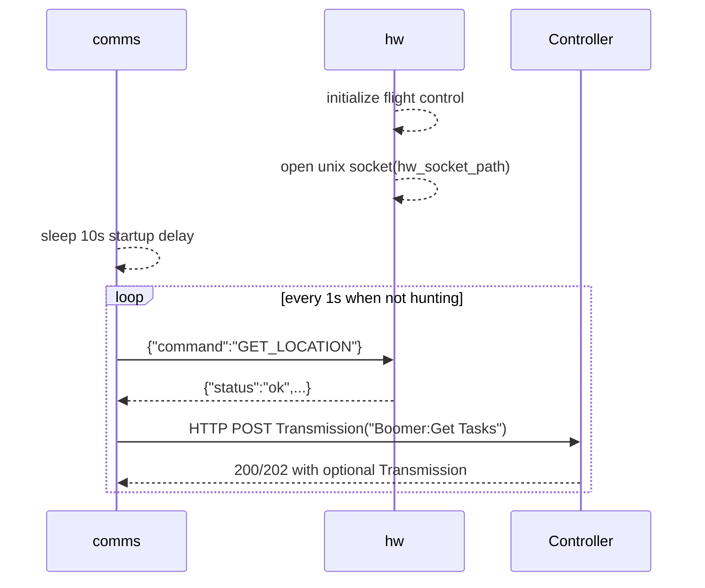
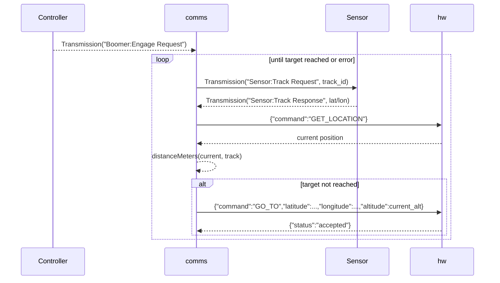

---
tags:
lecture:
date:
related:
aliases:
created: 2026-03-28T15:49
modified: 2026-03-28T15:49
---

# Boomer Technical Architecture

## Purpose

Boomer is a two-daemon node that separates:

- external mission communications (`comms`)
- local platform control and telemetry access (`hw`)

The `comms` daemon talks to controllers and sensors over HTTP/JSON. The `hw` daemon exposes a local Unix domain socket that `comms` uses as its hardware-control API, and `hw` is documented here as the component that reads position and flies the drone.

## High-Level Topology

```text
                  +----------------------+
                  |  Mission Controller  |
                  |   HTTP + JSON Tx     |
                  +----------+-----------+
                             ^
                             |
                             | "Boomer:Get Tasks"
                             | "Boomer:Engage Request"
                             | "Boomer:Engage Error"
                             |
+------------------+         |         +----------------------+
|   Sensor Service |<--------+-------->|    comms daemon      |
|   HTTP + JSON Tx | "Sensor:Track..." | task polling, engage |
+------------------+                   | state machine        |
                                       +----------+-----------+
                                                  |
                                                  | Unix domain socket
                                                  | JSON commands
                                                  | GET_LOCATION / GO_TO
                                       +----------v-----------+
                                       |      hw daemon       |
                                       | local control API    |
                                       | drone flight logic   |
                                       +----------------------+
```

## Runtime Components

### `comms` Daemon

Entrypoint: [`comms/main.go`]

Responsibilities:

- loads shared Boomer config
- polls one configured controller every second for work
- signs outbound transmissions when a private key is available
- optionally verifies signatures on inbound controller responses
- queries current platform position from the local `hw` daemon
- handles engage orders by querying a sensor and retasking `hw`
- reports engage failures back to the controller
- exits immediately on a `Shutdown` transmission

Core logic lives in:

- [`comms/pkg/communications/control.go`]
- [`comms/pkg/communications/hunt.go`]

### `hw` Daemon

Entrypoint: [`hw/main.go`]

Responsibilities:

- loads shared Boomer config
- opens a Unix domain socket for local command/telemetry requests
- reports the drone’s current position to `comms`
- accepts movement commands from `comms`
- returns normalized local JSON responses to `comms`

Core logic lives in:

- [`hw/pkg/server/server.go`]

## Deployment Shape

### NixOS Services

Both daemons are first-class systemd services:

- [`nix/modules/commsDaemon.nix`]
- [`nix/modules/hwDaemon.nix`]

Service characteristics:

- both start after `network-online.target`
- both receive `BOOMER_CONFIG_PATH`
- both restart on failure after 5 seconds
- `hwDaemon` creates a runtime directory and exposes a world-writable Unix socket path

### Container Image

[`nix/container.nix`] packages both daemons into one image and uses `runsvdir` to supervise them concurrently.

## Configuration Model

### Shared Boomer Config

The shared YAML config is loaded by both daemons from `BOOMER_CONFIG_PATH`.

Defined in:

- [`comms/pkg/config/config.go`]
- [`hw/pkg/config/config.go`]

Key fields:

```yaml
id: <uuid> # Boomer node identity
iff: <uint64> # vehicle entity ID, hw only
verbosity: warn|info|debug
key_path: /path/to/private.pem
verify_signatures: false
hw_socket_path: /tmp/boomer-hw.sock
controllers:
  - id: <uuid>
    pub_key: <base64 DER public key>
    ip_addr: http://controller.example/endpoint
hunt:
  poll_interval: 1s
  reach_distance_meters: 50.0
```

## Message and API Contracts

## 1. HTTP Transmission Envelope

All controller and sensor traffic uses the same JSON envelope defined in [`comms/pkg/messages/types.go`]:

```json
{
  "destination": "uuid",
  "source": "uuid",
  "msg": "json-encoded string payload",
  "msg_type": "Boomer:Get Tasks",
  "msg_sig": "base64-signature",
  "nonce": "base64url-random",
  "authority": {
    "endorsements": []
  }
}
```

Notes:

- `msg` is a string containing another JSON document, not a nested object
- outbound messages are signed if `key_path` contains a valid Ed25519 PKCS#8 private key
- verification only occurs for inbound controller responses when `verify_signatures: true`
- signature lookup only consults configured controller public keys

### Signature Material

Implementation:

- load private key: [`comms/pkg/messages/init.go`]
- sign/verify logic: [`comms/pkg/messages/sign.go`]

The signature hash is computed over:

1. `destination`
2. `source`
3. `msg`
4. `msg_type`
5. `nonce`

The nonce is generated during signing and becomes part of the signed material.

## 2. Local Unix Socket API between `comms` and `hw`

Socket path comes from `hw_socket_path`.

Request shape:

```json
{
  "command": "GET_LOCATION"
}
```

or

```json
{
  "command": "GO_TO",
  "latitude": 38.123,
  "longitude": -77.456,
  "altitude": 500.0
}
```

Response shape:

```json
{
  "status": "ok|accepted|error",
  "error": "optional text",
  "current_lat": 0.0,
  "current_lon": 0.0,
  "current_alt": 0.0
}
```

Command semantics:

- `GET_LOCATION`: `hw` returns the drone’s current coordinates
- `GO_TO`: `hw` accepts a waypoint and flies the drone toward it

## Operational Flows

## Startup and Steady State



Steady-state behavior details:

- `comms` waits 10 seconds before its first task request
- polling interval is fixed at 1 second in `control.go`
- if `hw` location lookup fails, `comms` falls back to `{0,0,0}` and still requests tasks
- controller responses may be empty; an empty body is treated as “no message”

## Controller Task Request Flow

### Outbound `Boomer:Get Tasks`

Payload embedded in `msg`:

```json
{
  "current_lat": 38.123,
  "current_lon": -77.456,
  "current_alt": 500.0
}
```

Envelope metadata:

- `destination`: active controller UUID
- `source`: boomer UUID
- `msg_type`: `Boomer:Get Tasks`

### Controller Selection and Failover

`comms` tracks:

- `lastSuccess`: the most recent working controller index
- `nextFallback`: the next controller to try after a failure

Behavior:

- successful request pins future traffic to that controller
- failure advances `nextFallback` to the next configured controller
- if the last successful controller fails, affinity is cleared and failover begins

This is local in-memory state only. There is no persistence across restarts.

## Engage Flow

When the controller returns `msg_type: "Boomer:Engage Request"`, `comms` unmarshals:

```json
{
  "track_id": "track-123",
  "sensor_id": "uuid",
  "sensor_host": "http://sensor.example/endpoint"
}
```

Only one hunt may run at a time. Additional engage requests are ignored while `hunting == true`.



Hunt loop details:

- `sensor_id` must parse as a UUID
- `sensor_host` must be non-empty
- sensor polling interval defaults to 1 second
- target reach threshold defaults to 50 meters
- distance is computed with a haversine formula on latitude/longitude only
- current altitude is reused for each `GO_TO`; the track response does not carry altitude

### Sensor request/response Contract

Request payload inside `msg`:

```json
{
  "track_id": "track-123"
}
```

Expected response:

- outer envelope `msg_type` must be `Sensor:Track Response`
- inner payload is:

```json
{
  "track_id": "track-123",
  "latitude": 38.5,
  "longitude": -77.1
}
```

If the returned `track_id` is empty, `comms` replaces it with the requested one. If it differs, `comms` logs a warning but still uses the returned coordinates.

### Engage Completion Behavior

If distance to target is less than or equal to the configured threshold:

- `comms` prints `Reached target <trackID>`
- `comms` exits the process with status `0`

This means a “successful intercept” currently terminates the communications daemon rather than returning to idle polling.

## Engage Error Reporting Flow

If the hunt loop fails, `comms` sends:

- `msg_type`: `Boomer:Engage Error`

Payload:

```json
{
  "track_id": "track-123",
  "error_msg": "failure details"
}
```

That error report is sent to the currently selected controller using the same failover and signing logic as task requests.

## Shutdown Flow

If a controller response transmission uses `msg_type: "Shutdown"`:

- `comms` logs the event
- `comms` immediately calls `os.Exit(0)`

There is no graceful handshake with `hw`.

## State Machines

### `comms` Daemon

```text
       +------+
       | Init |
       +--+---+
          |
          v
   +------+-------+
   | Polling Idle |
   +------+-------+
          |
          | optional "Boomer:Engage Request"
          v
   +------+-------+
   |   Hunting    |
   +---+------+---+
       |      |
       |      +-------------------+
       | error                    |
       v                          v
 +-----+------+            +------+------+
 | Exit success |          | Report error|
 +------------+-+          +------+------+
              ^                   |
              +-------------------+
                    back to idle
```

### `hw` Daemon Request Handling

```text
unix socket request
       |
       v
+------+------+
| decode JSON |
+------+------+
       |
       v
+------+------------------------------+
| normalize command from command/type |
+------+------------------------------+
       |
       +--> GET_LOCATION --> current position --> JSON ok/error
       |
       +--> GO_TO ---------> flight tasking ---> JSON accepted/error
       |
       +--> unknown -------> JSON error
```

## Message Inventory

### Between `comms` and Controller

- `Boomer:Get Tasks`
- `Boomer:Engage Request`
- `Boomer:Engage Error`
- `Shutdown`

### Between `comms` and Sensor

- `Sensor:Track Request`
- `Sensor:Track Response`

### Between `comms` and `hw`

- `GET_LOCATION`
- `GO_TO`

## Failure Modes and Edge Cases

- No controllers configured: `comms` exits with an error immediately.
- Socket path empty or entity ID zero: `hw` exits with an error immediately.
- Invalid or missing private key: outbound messages are sent unsigned.
- Signature verification enabled but controller key missing/invalid: inbound controller message is rejected.
- Controller returns non-200/202: request considered failed and failover advances.
- Sensor returns a non-transmission or wrong `msg_type`: hunt loop fails.
- `hw` socket unavailable: `comms` task requests still proceed using fallback location `0,0,0`.
- Successful hunt exits `comms`: unless a supervisor restarts it, controller polling stops.

## Practical Interpretation

Architecturally, Boomer is a split-control adapter:

- `comms` is the mission-facing state machine
- `hw` is the local motion/telemetry adapter
- `hw` is the component that directly reports position and executes movement
- controllers assign work
- sensors provide live target coordinates

All meaningful movement commands originate from `comms`, but no movement is executed there directly. Every movement action is mediated through the local `hw` socket and carried out by `hw`.
