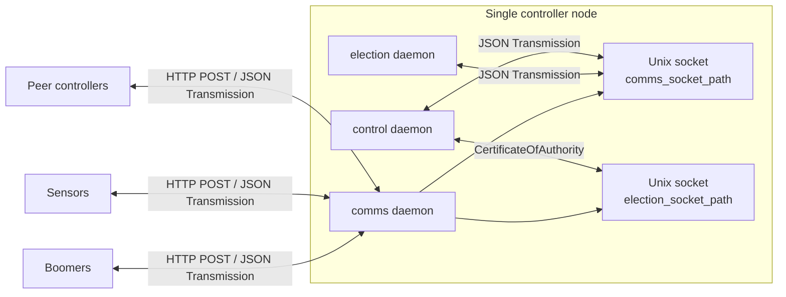
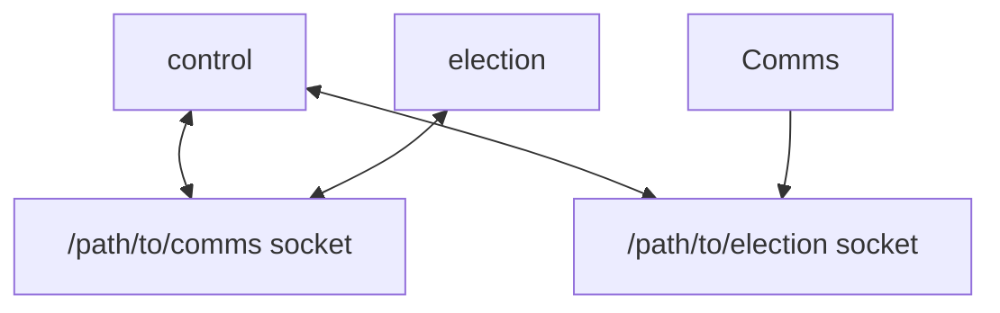
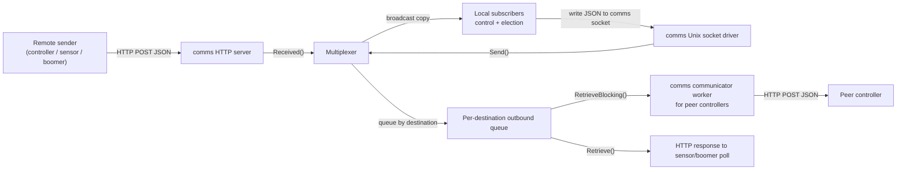
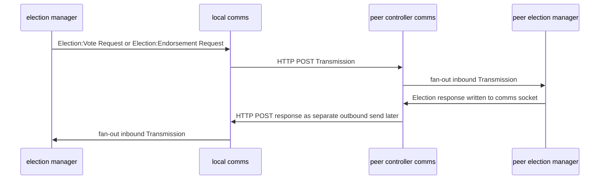
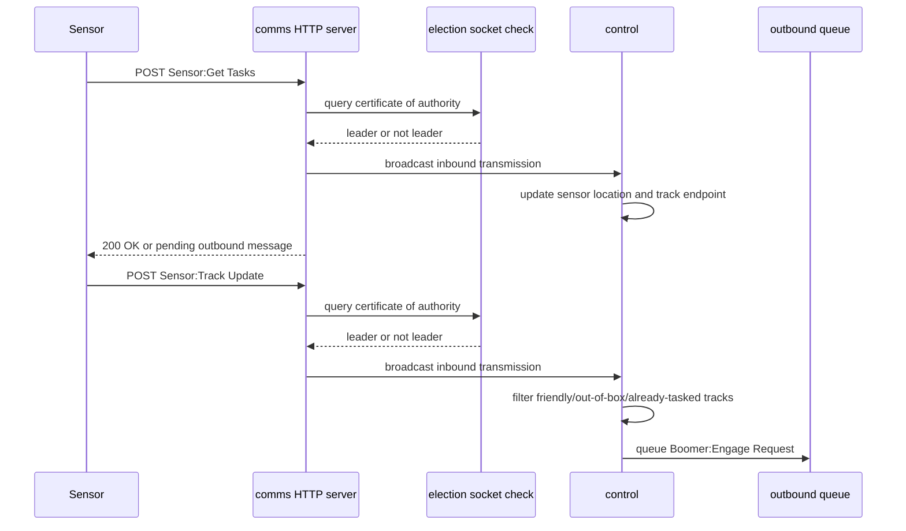
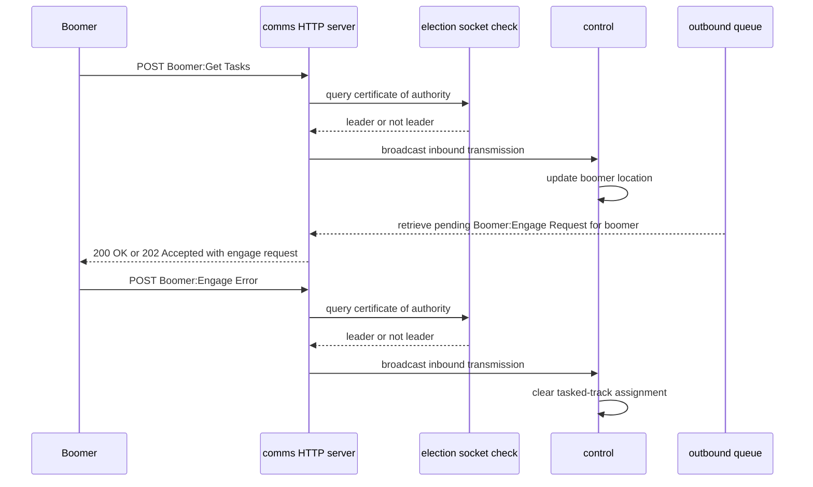

---
tags:
lecture:
date:
related:
aliases:
created: 2026-03-28T15:49
modified: 2026-03-28T17:51
---

# GildedGuardian Controller Architecture

This document describes how the controller node functions at runtime, with emphasis on daemon boundaries, internal IPC, controller-to-controller traffic, and the worker message flow used by sensors and boomers.

## Overview

Each controller node is composed of three daemons:

1. `comms`: the message bus and network edge.
2. `election`: the leader-election state machine and certificate-of-authority provider.
3. `control`: the mission logic that decides whether to task boomers against reported tracks.

The daemons are separate binaries, but they share the same node configuration and are tied together with Unix domain sockets.



## Deployment Structure

A node is configured from YAML loaded through `CONTROLLER_CONFIG_PATH`, and `control` also loads the mission box from `CONTROLLER_MISSION_PATH`.

Important configuration fields:

- `comms_socket_path`: Unix socket used by `control` and `election` to connect to `comms`.
- `election_socket_path`: Unix socket exposed by `election` so other local daemons can query current leadership.
- `listen_address` and `listen_port`: HTTP bind address for the `comms` server.
- `controllers`: peer controller IDs, public keys, and HTTP endpoints.
- **`sensors` and `boomers`: known worker IDs and public keys.**
- `verify_signatures`: when enabled, inbound HTTP messages are signature-checked by `comms`.

In the sample deployment, every controller container runs the three daemons and exposes its `comms` HTTP server on port `10000`.

## Daemon Responsibilities

### `comms`

`comms` has three roles:

1. Accept local daemon connections on the Unix socket driver.
2. Accept inbound HTTP messages from peer controllers, sensors, and boomers.
3. Queue and deliver outbound messages to peer controllers and worker clients.

Internally, `comms` uses a `Multiplexer` with two distinct paths:

- `Received`: fan-out of inbound messages to all local subscribers.
- `Send` and `Retrieve`: queued outbound delivery by destination UUID.

This makes `comms` both a local event bus and a per-destination outbound mailbox.

### `election`

`election` runs a Raft-like controller election with three states:

- `Follower`
- `Candidate`
- `Leader`

Its main outputs are:

- election protocol messages sent through `comms`
- a local certificate-of-authority view exposed on the election Unix socket

**The certificate of authority is the local proof that this node is currently leader.** *Other daemons do not inspect election state directly; they query this socket.*

### `control`

`control` contains the mission logic:

- tracks the latest reported locations of sensors and boomers
- filters tracks against the mission box and friendly IFF IDs
- chooses the closest available boomer for an eligible track
- emits `Boomer:Engage Request` messages through `comms`

`control` never becomes active unless the local node is leader.

## Internal IPC

Two Unix sockets connect the three daemons:



### `comms` Socket Semantics

The `comms` driver accepts a streaming JSON connection from local daemons.

Messages written by a local client:

- are validated for non-nil `source` and `destination`
- are signed by `comms` before queueing for outbound delivery
- are not automatically broadcast back as received traffic

Messages read by a local client:

- are copies of inbound traffic that arrived through the HTTP server
- are broadcast to every subscribed local daemon connection

This asymmetry is important:

- local daemons write outbound intent to `comms`
- local daemons read only externally received transmissions from `comms`

### `election` Socket Semantics

The `election` driver is requestless from the client side. A local client connects, reads one JSON payload, and disconnects.

The payload is:

- the current `CertificateOfAuthority` if this node is leader
- an empty certificate if this node is not leader

Both `control` and `comms` use this socket as a leadership oracle.

## End-to-End Message Topology

### Top-level Flow



### Message Classes

There are three functional classes of traffic:

1. Controller-election traffic between controllers.
2. Worker polling traffic from sensors and boomers to the current leader.
3. Tasking traffic sent back from the leader to boomers.

All three use the same outer `Transmission` envelope:

```json
{
  "destination": "uuid",
  "source": "uuid",
  "msg": "string payload",
  "msg_type": "string",
  "msg_sig": "optional signature",
  "nonce": "optional nonce",
  "authority": {}
}
```

Election payloads are JSON serialized and then base64url-encoded into `msg`.

Control-plane worker payloads are plain JSON serialized into `msg`.

## Election Flow Between Controllers

The election subsystem only processes messages whose `msg_type` starts with `Election:`.



Election behavior, as implemented:

- followers and candidates start a new election when their timer expires
- candidates vote for themselves, seek votes from all peer controllers, and become leader on quorum
- leaders periodically seek endorsements from peer controllers
- endorsements are stored and filtered for validity before being exposed as a certificate of authority

Leadership is therefore inferred from endorsements, not merely from local state.

## Worker Message Flow

Sensors and boomers interact with the leader through polling. They do not hold a persistent local socket connection to `comms`.

### Sensor Polling and Track Updates



Important details:

- `Sensor:Get Tasks` updates the sensor’s last known position and normalizes its advertised track server endpoint to end with `/tracks/`.
- `Sensor:Track Update` is ignored if the sensor has not previously registered a server address through `Sensor:Get Tasks`.
- only the current leader processes these messages; followers reject them at the `comms` HTTP ingress layer.

### Boomer Polling and Engage Tasking



The boomer only receives a queued engage request when it polls. `comms` does not actively push worker messages.

## Control Decision Logic

The `control` daemon is intentionally simple and stateful.

### State it Maintains

- latest sensor locations and track-server URLs
- latest boomer locations
- current track-to-boomer assignments
- reverse boomer-to-track assignments

### Decision Rules for a Track Update

For each reported track:

1. Ignore it if the track ID is in the friendly set.
2. Ignore it if the track lies outside the mission bounding box.
3. Ignore it if the track is already assigned to a boomer.
4. Find the closest boomer that is not already busy.
5. Emit `Boomer:Engage Request` to that boomer.
6. Record the assignment so the same track is not re-tasked.

The current distance metric is a simple squared Euclidean comparison over latitude and longitude, not a geodesic distance.

### Leadership Gating inside `control`

**Even after a message reaches `control`, the daemon performs its own leader check through the election socket before handling non-election traffic.**

That means non-election worker traffic is leader-gated twice:

1. at `comms` HTTP ingress for messages from non-controller sources
2. again inside `control` before mission logic runs

## `comms` Outbound Delivery Model

The outbound side behaves differently for controllers and workers.

### Controller-to-controller Delivery

- local daemons queue outbound transmissions by destination controller UUID
- one communicator worker runs per configured peer controller
- each worker blocks until a message is queued for its peer
- the worker sends the message as an HTTP `POST` to that peer’s configured `ip_addr`

### Worker Delivery by Poll Response

- outbound messages destined for sensors or boomers are queued by UUID
- when that worker later sends an HTTP request, `comms` immediately checks for a queued response
- if one exists, it returns HTTP `202 Accepted` and the queued `Transmission`
- if none exists, it returns HTTP `200 OK` with no transmission body

This is effectively a poll/long-poll-lite mailbox model for workers.

## Security and Validation

Implemented controls:

- optional inbound signature verification in `comms`
- known-source public-key lookup from config
- non-controller traffic accepted only by the current leader
- local outbound signing before `comms` queues a transmission

Current trust model limitations:

- the `comms` Unix socket is world-writable after bind (`0777`)
- a local client connected to the `comms` socket receives all inbound external traffic
- worker requests are accepted based on configured UUID and optional signature validation, not mTLS or session authentication

## Failure and Recovery Characteristics

- `control` and `election` retry connection to the `comms` socket if it is unavailable.
- **`election` exposes an empty certificate when not leader, which causes local leadership checks to fail closed.**
- `comms` worker queues are in-memory only; queued outbound messages are lost on restart.
- `control`‘s worker locations and track assignments are also in-memory only.
- if a boomer reports `Boomer:Engage Error`, the corresponding track assignment is cleared and can be re-tasked later.

## Practical Execution Model

At runtime, a healthy node behaves like this:

1. `comms` starts the Unix socket driver, HTTP server, and one communicator worker per peer controller.
2. `election` connects to the `comms` socket, joins the inbound message stream, and starts its timers.
3. `control` connects to the `comms` socket, waits for non-election traffic, and stays passive unless the node is leader.
4. sensors and boomers poll the leader’s HTTP endpoint.
5. peer controllers exchange election traffic over HTTP through their respective `comms` daemons.
6. the leader’s `control` daemon converts sensor track updates into boomer engage requests, which are returned on later boomer polls.

## File Map

The implementation described here is primarily located in:

- `comms/main.go`
- `comms/pkg/multiplexer/multiplex.go`
- `comms/pkg/communications/server.go`
- `comms/pkg/communications/communicator.go`
- `comms/pkg/driver/driver.go`
- `election/main.go`
- **`election/pkg/manager/manager.go`**
- **`election/pkg/manager/handlers.go`**
- `election/pkg/driver/driver.go`
- `control/main.go`
- `control/pkg/comms/types.go`
- `control/pkg/config/config.go`
