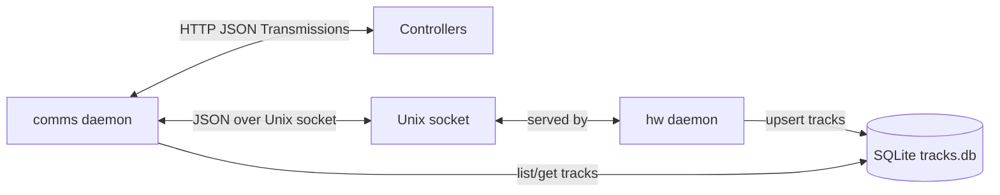
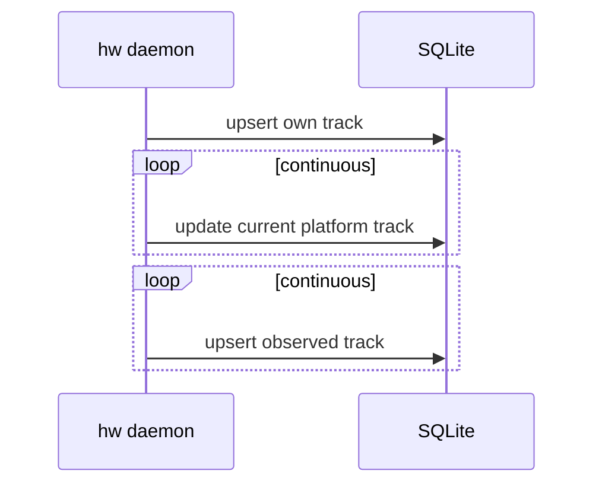
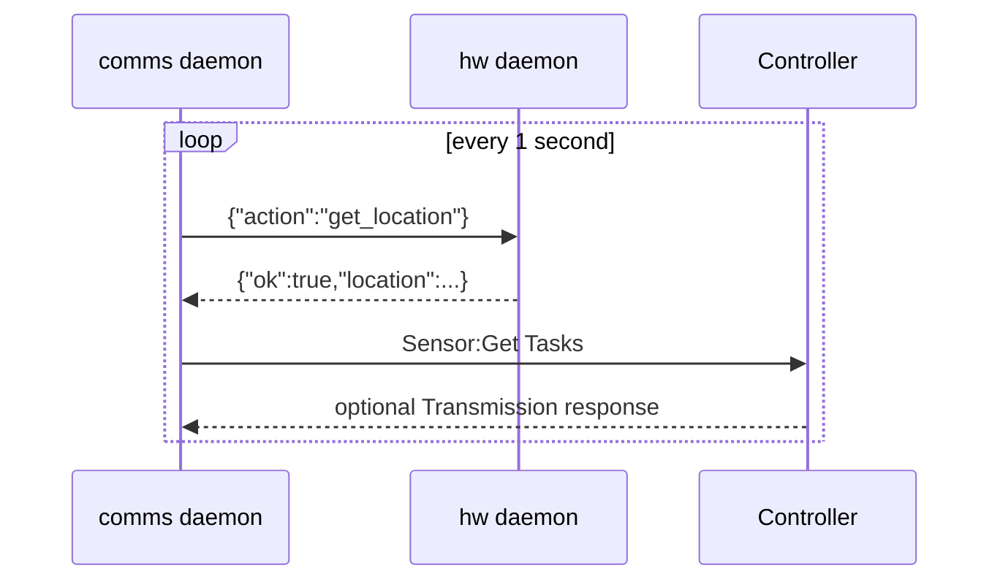
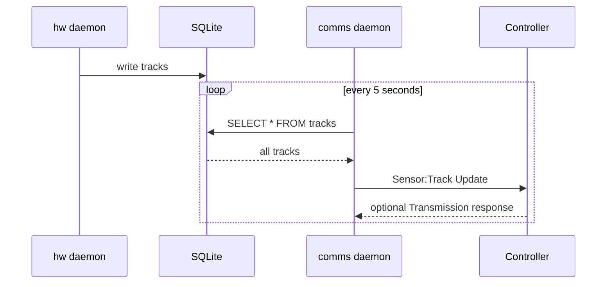
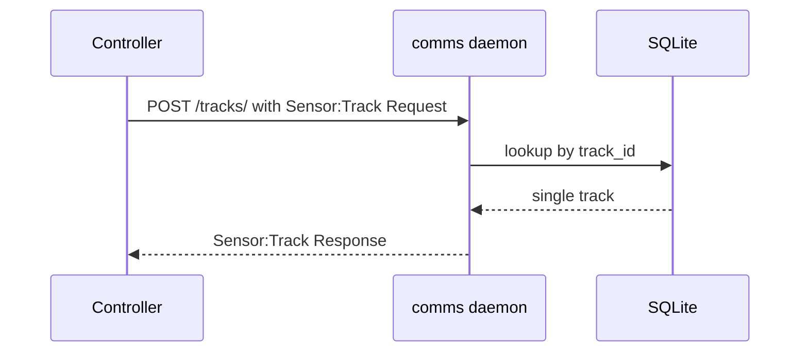

---
tags:
lecture:
date:
related:
aliases:
created: 2026-03-28T15:49
modified: 2026-03-28T17:53
---

# Sensor Technical Documentation

This repository implements a sensor node as two cooperating daemons:

- `hw`: the local hardware daemon that maintains the sensor platform’s current state, ingests detections, and persists track data.
- `comms`: the communications daemon that exposes the controller-facing HTTP API, publishes track updates, and queries `hw` over a local Unix domain socket for current location.

Both daemons read the same YAML config file, share the same SQLite track database, and are intended to run together as systemd services.

## Component Topology

```text
                  +---------------------------------------------------+
                  |                    Sensor Node                     |
                  |                                                   |
Controllers <---->|   +---------------------+      Unix socket        |
HTTP POST         |   | comms daemon        |<--------------------+   |
                  |   |                     |                     |   |
                  |   | - HTTP server       |                     |   |
                  |   | - task requests     |                     |   |
                  |   | - track updates     |                     |   |
                  |   +----------+----------+                     |   |
                  |              |                                |   |
                  |              | shared SQLite                  |   |
                  |              v                                |   |
                  |   +---------------------+                     |   |
                  |   | tracks.db           |                     |   |
                  |   | table: tracks       |                     |   |
                  |   +----------+----------+                     |   |
                  |              ^                                |   |
                  |              |                                |   |
                  |   +----------+----------+                     |   |
                  |   | hw daemon           |---------------------+   |
                  |   |                     |                         |
                  |   | - current location  |                         |
                  |   | - detection intake  |                         |
                  |   | - goto handler      |                         |
                  |   +---------------------+                         |
                  +---------------------------------------------------+
```



## Runtime Structure

### `hw` Daemon

`hw/main.go` starts the hardware daemon, validates the configured IFF/entity ID, opens the shared SQLite database, initializes current platform state, and launches three concurrent responsibilities:

1. `refreshCurrentLocation`: seeds the current navigation state.
2. `streamNavStatus`: continuously updates the daemon’s in-memory current location.
3. `streamSensorData`: continuously stores observed tracks.

It also serves a Unix domain socket at `comms_socket_path` for local requests from `comms`.

### `comms` Daemon

`comms/main.go` opens the same SQLite database, starts an HTTP server, and starts the communicator loop.

The communicator loop has two periodic jobs:

- Every 5 seconds: read all tracks from SQLite and send a `Sensor:Track Update` transmission to a controller.
- Every 1 second: ask `hw` for current location over the Unix socket, then send a `Sensor:Get Tasks` transmission to a controller.

The HTTP server accepts controller-initiated `Sensor:Track Request` transmissions and responds with `Sensor:Track Response`.

### Shared State

Both daemons use the same SQLite schema:

```sql
CREATE TABLE tracks (
  track_id   TEXT PRIMARY KEY,
  latitude   REAL,
  longitude  REAL
);
```

`hw` is the writer of track data. `comms` is primarily a reader, except for schema initialization at startup.

## Internal Interfaces

### 1. Local Unix Socket Interface

The `hw` daemon exposes a JSON protocol over `comms_socket_path`.

Supported requests:

```json
{"action":"get_location"}
```

```json
{
  "action":"goto",
  "latitude": 37.5,
  "longitude": -122.2,
  "altitude": 1000,
  "speed": 120,
  "linger": 10
}
```

Responses:

```json
{
  "ok": true,
  "location": {
    "latitude": 37.5,
    "longitude": -122.2,
    "altitude": 1000
  }
}
```

```json
{"ok":false,"error":"unknown action"}
```

Current usage:

- `comms` only uses `get_location`.
- `goto` is implemented in `hw` but is not currently invoked anywhere in this repository.

### 2. Controller HTTP Interface

The `comms` daemon listens on `listen_address:listen_port`.

The only inbound route implemented here is:

- `POST /tracks/`

Request body must be a `Transmission` with:

- `msg_type = "Sensor:Track Request"`
- `msg` containing JSON like `{"track_id":"12345"}`

Response body is another `Transmission` with:

- `msg_type = "Sensor:Track Response"`
- `msg` containing the serialized track record

The communicator also sends outbound HTTP POSTs to each configured controller `ip_addr`.

## Transmission Envelope

Controller-facing traffic uses this JSON structure:

```json
{
  "destination": "uuid",
  "source": "uuid",
  "msg": "json-encoded payload string",
  "msg_type": "Sensor:Get Tasks",
  "msg_sig": "base64 signature",
  "nonce": "base64url nonce",
  "authority": {
    "endorsements": []
  }
}
```

Fields:

- `destination`: intended receiver UUID.
- `source`: sender UUID.
- `msg`: payload serialized as a string containing JSON.
- `msg_type`: logical message type.
- `msg_sig`: Ed25519 signature over destination, source, msg, msg_type, and nonce.
- `nonce`: random 16-byte value, base64url encoded.
- `authority`: certificate-of-authority endorsements. The data type exists, but this repository does not currently attach or enforce COA validation during normal message handling.

## Message Flow

### A. Steady-state Data Ingestion



Notes:

- The sensor’s own track is stored with `track_id = strconv.FormatUint(entityID, 10)`.
- All observed contacts are stored in the same `tracks` table.
- `hw` keeps richer current-state data in memory and persists the track subset needed by `comms`.

### B. Task Polling Path



`Sensor:Get Tasks` payload:

```json
{
  "current_lat": 0,
  "current_lon": 0,
  "current_alt": 0,
  "server_address": "http://<sensor-ip>:<listen_port>"
}
```

Important behavior:

- `server_address` is built from the first non-loopback IPv4 address found on the host plus `listen_port`.
- The communicator initially waits 10 seconds before starting periodic work.
- Controller selection is sticky: the last successful controller remains preferred; failures trigger fallback to the next configured controller.

### C. Track Publication Path



`Sensor:Track Update` payload:

- JSON array of all records currently in `tracks`.

This is a full-state push, not a delta feed.

### D. On-demand Track Lookup Path



If the track is missing, `comms` returns HTTP `404`.

## Message Types Implemented Here

Implemented and actively used:

- `Sensor:Get Tasks`
- `Sensor:Track Update`
- `Sensor:Track Request`
- `Sensor:Track Response`
- `Shutdown` response handling in `comms`

Implemented but not actively used by repository codepaths:

- Unix socket action `goto`
- COA endorsement verification helpers
- Worker public key support in signature verification

Behavior for `Shutdown`:

- If a controller responds to an outbound message with a transmission whose `msg_type` is `Shutdown`, `comms` exits the process immediately.

## Signature and Trust Model

Outgoing controller-bound transmissions are signed when `key_path` points to a readable Ed25519 PKCS#8 private key. If key loading fails, messages are still sent, but unsigned.

Inbound signature verification is conditional:

- `verify_signatures: false` means inbound HTTP/controller messages are accepted without signature checks.
- `verify_signatures: true` enables signature verification against configured controller and worker public keys.

What is verified today:

- Inbound `Sensor:Track Request` HTTP calls to `comms`
- Transmission responses received by `comms` after outbound sends

What is not enforced in the normal runtime path:

- COA endorsement verification
- Signature verification on local Unix socket traffic
- Any auth on the local socket beyond filesystem access to the socket path

## Configuration Model

Both daemons read `SENSOR_CONFIG_PATH` and expect a shared YAML file with fields such as:

```yaml
id: <sensor-uuid>
iff: <platform entity id>
key_path: /path/to/private_key.pem
gps_db_path: /path/to/tracks.db
listen_address: "0.0.0.0"
listen_port: 8000
comms_socket_path: /tmp/comms.sock
verify_signatures: false
controllers:
  - id: <controller-uuid>
    pub_key: <base64 pkix public key>
    ip_addr: "http://controller:10000"
workers: []
```

Environment variables relevant to the documented interfaces:

- `SENSOR_CONFIG_PATH`: shared YAML config for both daemons

## Service Layout

NixOS modules in `nix/modules/` install both daemons as separate `systemd` services:

- `commsDaemon`
- `hwDaemon`

Both are configured to:

- start after `network-online.target`
- restart on failure
- consume the shared config from `/etc/sensor/config.yaml` by default

## Operational Characteristics

- `hw` owns live state acquisition and local track persistence.
- `comms` owns all controller-facing network traffic.
- SQLite is the handoff boundary between ingestion and publication.
- The Unix socket is the handoff boundary for current-location queries.
- There is no explicit leader election or message queue in this node.
- Track publication is periodic and snapshot-based.
- Controller failover is local, sequential, and memory-only.

## Known Gaps and Design Implications

- *`comms` and `hw` both open and migrate the same SQLite database, so startup races are possible in principle, although GORM/SQLite typically tolerates this pattern.*
- `Track` records persist only latitude and longitude; altitude and heading are kept in `hw` memory but are not stored in SQLite.
- `POST /tracks/` is registered with a trailing slash and is the only inbound HTTP route.
- `sendTransmission` posts directly to each controller’s configured `ip_addr`; controller-side path semantics are defined outside this repository.
- The `workers` and COA structures indicate a larger trust model, but this sensor implementation only uses a subset of it.

## Summary

The sensor is a two-daemon node with a clear split of responsibilities:

- `hw` converts local platform state into persisted tracks and local command/query responses.
- `comms` converts persisted tracks and current position into signed HTTP transmissions for controllers.
- Controllers can query the sensor back for a specific track via `POST /tracks/`.

The primary message boundaries are:

1. JSON over a Unix socket between `comms` and `hw`
2. JSON/HTTP transmission envelopes between `comms` and controllers
